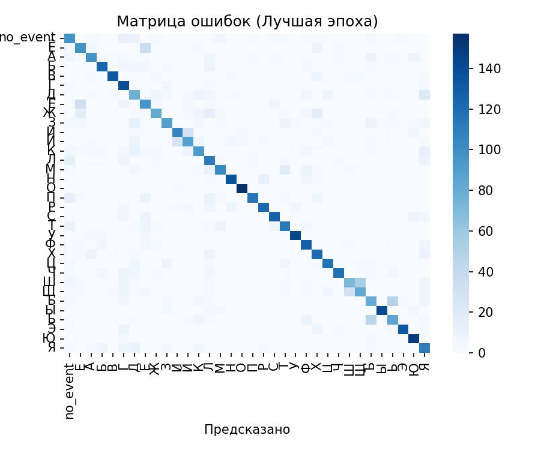
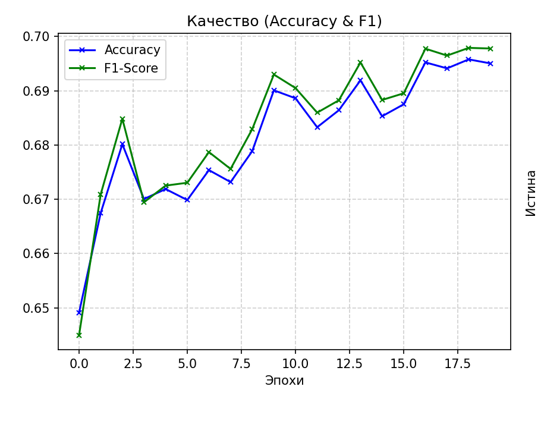
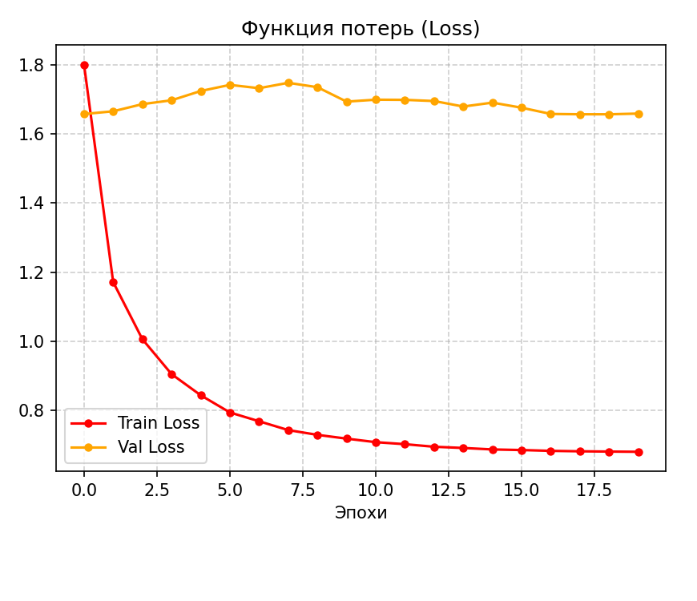

# Тема работы
Распознавание русского жестового языка (РЖЯ) на встраиваемой платформе Orange Pi 5B

Данный раздел репозитория содержит реализацию высокоэффективной системы локального (Edge AI) распознавания дактильных жестов русского жестового языка (РЖЯ) на базе одноплатного компьютера **Orange Pi 5B** с использованием нейросетевой архитектуры **MobileNetV2** и аппаратного ускорителя **NPU (RK3588S)**.

---

## Описание выполненной работы

В рамках работы реализован полный конвейер обработки видеопотока и классификации жестов:
1. **Препроцессинг и детектирование:** Интеграция фреймворка MediaPipe для автоматической локализации и кадрирования области кисти руки (ROI), что позволило увеличить полезную площадь объекта в **30 раз** относительно исходного разрешения кадра и избавиться от фонового шума.
2. **Обучение модели:** Обучение сверточной нейросети MobileNetV2 на датасете *Bukva* (разделение выборки выполнено по дикторам для объективной проверки обобщающей способности).
3. **Оптимизация и квантование:** Экспорт PyTorch-модели в ONNX и последующая компиляция в бинарный формат RKNN с применением пост-обучающего поканального квантования (Per-channel PTQ). Это позволило сжать модель в 4 раза (до **2.2 МБ**) при хорошем сохранении точности.
4. **Параллельный инференс:** Разработка многопоточного конвейера на Orange Pi 5B, распределяющего нагрузку между процессором (MediaPipe) и 3 ядрами NPU (инференс RKNN).

---

## Поставленные задачи

- [x] Исследовать применимость легких покадровых архитектур (MobileNetV2) для задач локального распознавания РЖЯ.
- [x] Разработать модуль предобработки кадров на базе MediaPipe для выделения области кисти руки.
- [x] Обучить классификатор на датасете *Bukva* (34 класса: дактильный алфавит + «пустой жест») с разделением по дикторам.
- [x] Выполнить конвертацию модели из PyTorch в ONNX, а затем в целевой формат `.rknn` через `rknn-toolkit2`.
- [x] Применить поканальное (per-channel) квантование PTQ для минимизации потерь точности на глубинных свертках.
- [x] Настроить многопоточный инференс на целевом одноплатном компьютере Orange Pi 5B с асинхронным исполнением на NPU и CPU.
- [x] Оценить граничные метрики точности, производительности (FPS) и вычислительные узкие места системы.

---

## Установленные компоненты и библиотеки

### На хост-машине (для обучения и конвертации):
- **ОС:** Ubuntu 25.04
- **Python:** 3.10.20
- **PyTorch:** 2.4.0+cpu
- **torchvision:** 0.19.0+cpu 
- **ONNX:** 1.14.1 
- **rknn-toolkit2:** 2.3.2
- **MediaPipe:** 0.10.35

### На одноплатном компьютере Orange Pi 5B (для инференса):
- **rknn-toolkit-lite2 (Python API) / RKNN C-API:** 2.3.2
- **OpenCV-Python:** 4.11.0.86
- **NumPy:** 1.26.4

---

## Архитектура конвейера обработки

Здесь нужно дополнить инфу

--- 

## Результаты работы

